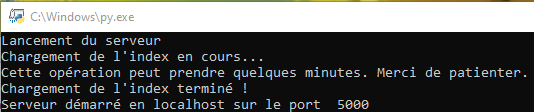
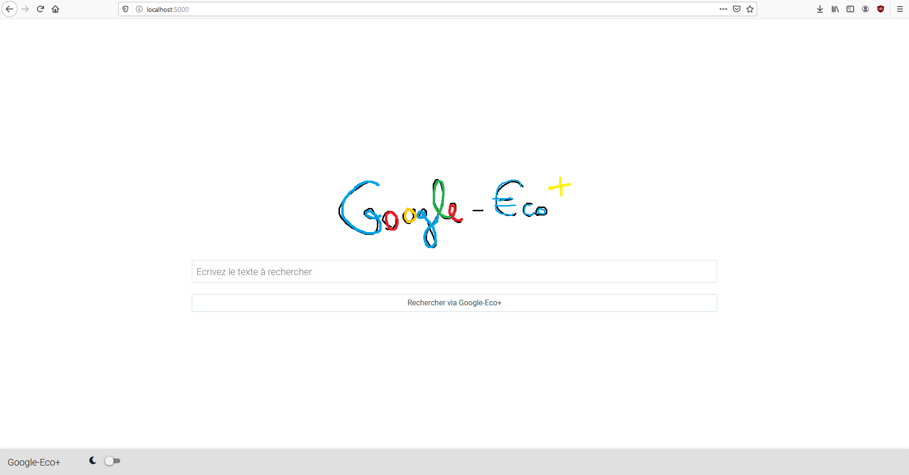
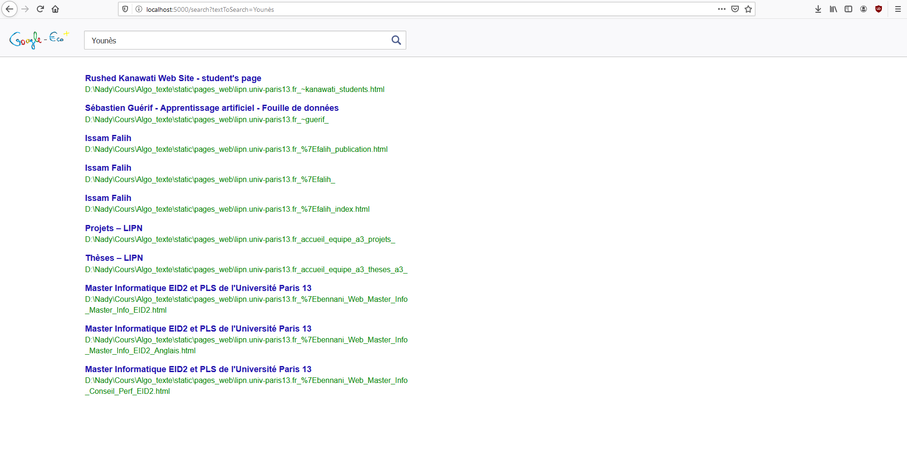

# Google-Eco+, le moteur de recherche qui ressemble à Google, mais en version Eco+  - *Algorithmique du texte, M1 Informatique*
Le moteur de recherche Google-Eco+ a été réalisé dans le cadre d'un projet d' **Algorithmique du texte** en Master 1 Informatique à l'Institut Galilée (USPN). Voici les membres du groupe y ayant participé :

 - Nady SADDIK
 - Alexandre KARAKAS
 - David HONG

## Instructions d'utilisation
### 1. Télécharger puis extraire l'archive
Rendez-vous sur la branche **master** (qui est celle sélectionnée par défaut), et sélectionnez **Download ZIP**.
Il faut ensuite extraire le .zip, ce dernier contenant trois choses :
 1. Des dossiers nécessaires au bon fonctionnement du moteur de recherche
 2. Un fichier server.py
 3. Le README

### 2. Démarrer le serveur
La manipulation est très simple, il suffit tout simplement de lancer le fichier server.py en utilisant la commande suivante :

    python server.py [NUMERO_DU_PORT]

*(La variable entre crochets est optionnelle)*

Par défaut, le port choisi est le port 5000. Le serveur démarrera donc sur ce port-là si vous ne précisez pas le numéro du port que vous souhaitez utiliser.

### 3. Utiliser le moteur de recherche
 Dans votre navigateur web favori, entrez l'URL suivante : [http://localhost:NUM_PORT](http://localhost:5000) (en remplaçant NUM_PORT par le port utilisé)
Vous arriverez alors sur la page d'accueil :

Vous pouvez alors tenter une recherche et Google-Eco+ fera au mieux pour vous afficher le bon résultat !
